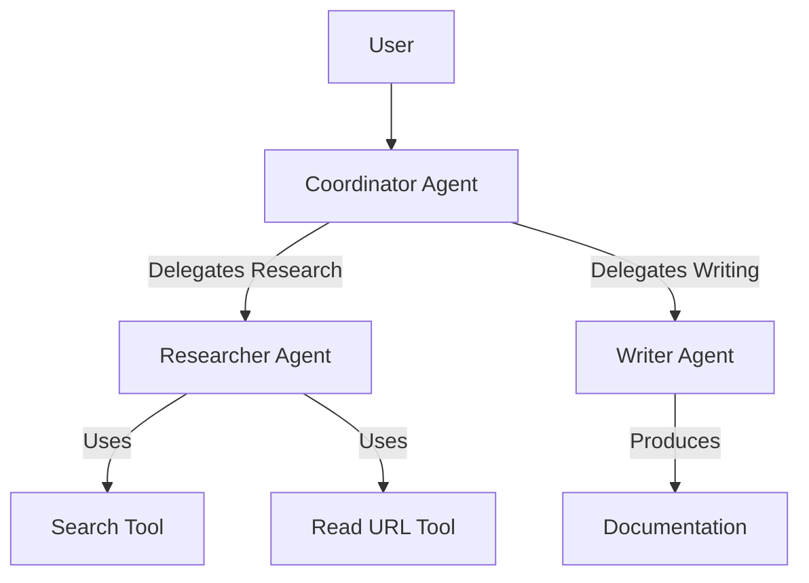

# InsightArchitect: Multi-Agent Technical Research Assistant

**InsightArchitect** is a multi-agent system built with the Google Agent Development Kit (ADK). It orchestrates specialized agents to research technical topics and generate comprehensive, well-structured documentation.

## Capabilities Demonstrated

1.  **Multi-Agent Systems**: Uses a `Coordinator` agent to manage a `Researcher` (for information gathering) and a `Writer` (for content synthesis).
2.  **Tools**: Implements custom tools for web search and content extraction.
3.  **Memory**: Maintains session context to refine outputs based on user interaction.

## Architecture



## Quick Start

1.  **Install Dependencies**:

    ```bash
    pip install -r requirements.txt
    ```

2.  **Setup Environment**:
    Copy `.env.example` to `.env` and add your `GOOGLE_API_KEY`.

    ```bash
    cp .env.example .env
    ```

3.  **Run the Agent**:
    ```bash
    adk run my_agent
    ```

## Directory Structure

- `my_agent/`: Contains the agent logic.
- `tools/`: Custom tool implementations.
- `evaluation/`: Evaluation datasets and configs.
